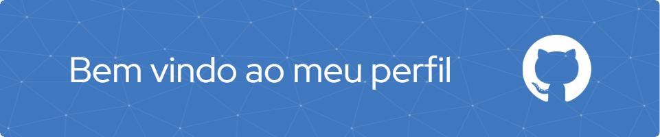

### 🤔 Apresentação:
Meu nome e Nil e estou aprendendo a programar.

## 🌟 Tecnologias que tive contato

## 📋 Status 

          

## 🔍 Social Media

## 🗃️ Links Úteis

[Tags tecnologias(Badges4-README.md-Profile)](https://github.com/alexandresanlim/Badges4-README.md-Profile#-languages-)

[Github Profile Header Generator](https://leviarista.github.io/github-profile-header-generator/)

[github-readme-stats](https://github.com/anuraghazra/github-readme-stats)

[github-profile-trophy](https://github.com/ryo-ma/github-profile-trophy)

<!--
**gnilfm/gnilfm** is a ✨ _special_ ✨ repository because its `README.md` (this file) appears on your GitHub profile.

Here are some ideas to get you started:

- 🔭 I’m currently working on ...
- 🌱 I’m currently learning ...
- 👯 I’m looking to collaborate on ...
- 🤔 I’m looking for help with ...
- 💬 Ask me about ...
- 📫 How to reach me: ...
- 😄 Pronouns: ...
- ⚡ Fun fact: ...
-->
